# NUTRI CONNECT - Complete ER Diagram

## Mermaid ER Diagram Code

```mermaid
erDiagram
    USERAUTH ||--o| USER : "has"
    USERAUTH ||--o| ADMIN : "has"
    USERAUTH ||--o| DIETITIAN : "has"
    USERAUTH ||--o| ORGANIZATION : "has"
    USERAUTH ||--o| EMPLOYEE : "has"
    
    USER ||--o{ BOOKING : "creates"
    USER ||--o{ PROGRESS : "tracks"
    USER ||--o{ LABREPORT : "submits"
    USER ||--o{ HEALTHREPORT : "receives"
    USER ||--o{ MEALPLAN : "assigns-to"
    USER ||--o{ BLOG : "authors"
    USER ||--o{ CONVERSATION : "participates"
    USER ||--o{ MESSAGE : "sends"
    USER ||--o{ COMMENT : "writes"
    USER ||--o{ LIKE : "creates"
    
    DIETITIAN ||--o{ BOOKING : "receives"
    DIETITIAN ||--o{ BLOCKEDSLOT : "creates"
    DIETITIAN ||--o{ LABREPORT : "reviews"
    DIETITIAN ||--o{ HEALTHREPORT : "creates"
    DIETITIAN ||--o{ MEALPLAN : "creates"
    DIETITIAN ||--o{ BLOG : "authors"
    DIETITIAN ||--o{ CONVERSATION : "participates"
    DIETITIAN ||--o{ MESSAGE : "sends"
    DIETITIAN ||--o{ COMMENT : "writes"
    DIETITIAN ||--o{ TESTIMONIAL : "receives"
    
    ORGANIZATION ||--o{ EMPLOYEE : "employs"
    ORGANIZATION ||--o{ ACTIVITYLOG : "logs"
    ORGANIZATION ||--o{ TEAMBOARD : "posts-on"
    
    EMPLOYEE ||--o{ ACTIVITYLOG : "creates"
    EMPLOYEE ||--o{ EMPLOYEEQUERY : "submits"
    EMPLOYEE ||--o{ TEAMBOARD : "posts-on"
    
    BOOKING ||--|| PAYMENT : "has"
    BOOKING ||--o{ BLOCKEDSLOT : "references"
    
    LABREPORT ||--o{ LABCATEGORY : "contains"
    LABREPORT ||--o{ UPLOADEDFILE : "has"
    
    HEALTHREPORT ||--o{ UPLOADEDFILE : "has"
    
    MEALPLAN ||--o{ MEAL : "contains"
    
    BLOG ||--o{ COMMENT : "contains"
    BLOG ||--o{ LIKE : "receives"
    BLOG ||--o{ REPORT : "receives"
    BLOG ||--o{ UPLOADEDFILE : "has"
    
    CONVERSATION ||--o{ MESSAGE : "contains"
    
    MESSAGE ||--o{ READRECEIPT : "has"
    MESSAGE ||--o{ UPLOADEDFILE : "has"
    
    FAQ ||--o{ KEYWORD : "has"
    
    CHATHISTORY ||--o{ CHATMESSAGE : "contains"
    
    NUTRITIONCACHE ||--o{ NUTRIENT : "has"
    
    CONTACTQUERY ||--o{ REPLY : "has"
    
    TEAMBOARD ||--o{ TEAMPOST : "contains"

    USERAUTH {
        string email PK "unique"
        string passwordHash
        string role "enum"
        objectid roleId FK
        date timestamps
    }
    
    USER {
        objectid userId PK
        string name "min:5"
        string email FK
        string phone "10-digits"
        date dob
        string gender "enum"
        string address
        binary profileImage
        date timestamps
    }
    
    ADMIN {
        objectid adminId PK
        string name "min:5"
        string email FK
        string phone "10-digits"
        date dob
        string gender "enum"
        string address
        binary profileImage
        date timestamps
    }
    
    DIETITIAN {
        objectid dietitianId PK
        string name "min:5"
        string email FK
        string licenseNumber "unique"
        array specialization
        number experience
        number fees
        object verificationStatus
        object availability
        array consultationTypes
        array testimonials
        number rating
        object socialMedia
        binary profileImage
        boolean isDeleted
        date timestamps
    }
    
    ORGANIZATION {
        objectid orgId PK
        string name "unique"
        string email FK
        string phone
        string address
        string licenseNumber "unique"
        string organizationType "enum"
        object files
        object verificationStatus
        binary profileImage
        date timestamps
    }
    
    EMPLOYEE {
        objectid employeeId PK
        string name "min:3"
        string email FK
        string passwordHash
        string licenseNumber "unique"
        objectid organizationId FK
        string status "enum"
        number age
        string address
        date inviteSentAt
        date activatedAt
        date lastLogin
        date timestamps
    }
    
    BOOKING {
        objectid bookingId PK
        objectid userId FK
        string username
        string email
        string userPhone
        objectid dietitianId FK
        string dietitianName
        date date "required"
        string time "HH:MM"
        string consultationType "enum"
        number amount
        string paymentMethod "enum"
        string paymentId "unique"
        string paymentStatus "enum"
        string status "enum"
        date createdAt
        date updatedAt
    }
    
    BLOCKEDSLOT {
        objectid slotId PK
        objectid dietitianId FK
        string date
        string time
        string reason
        date timestamps
    }
    
    PAYMENT {
        objectid paymentId PK
        objectid userId FK
        objectid bookingId FK
        number amount
        string method "enum"
        string gatewayId
        string status "enum"
        date timestamp
    }
    
    PROGRESS {
        objectid progressId PK
        objectid userId FK
        string plan "enum"
        number weight
        number waterIntake
        number calories
        number steps
        string goal
        number days "1-365"
        string notes
        date createdAt
        date updatedAt
    }
    
    LABREPORT {
        objectid reportId PK
        objectid userId FK
        objectid dietitianId FK "optional"
        string clientName
        number clientAge
        string clientPhone
        array submittedCategories
        object hormonalData
        object fitnessData
        object generalData
        object bloodSugarData
        object thyroidData
        object cardiovascularData
        array uploadedFiles
        string status "enum"
        object reviewedBy
        string notes
        date timestamps
    }
    
    LABCATEGORY {
        objectid categoryId PK
        string categoryName "enum"
        object categoryData
    }
    
    HEALTHREPORT {
        objectid reportId PK
        objectid dietitianId FK
        string dietitianName
        objectid clientId FK
        string clientName
        string title
        string diagnosis
        string findings
        string dietaryRecommendations
        string lifestyleRecommendations
        string supplements
        string followUpInstructions
        string additionalNotes
        array uploadedFiles
        string status "enum"
        date timestamps
    }
    
    MEALPLAN {
        objectid planId PK
        string planName
        string dietType "enum"
        number calories
        string notes
        string imageUrl
        array assignedDates
        objectid dietitianId FK
        objectid userId FK
        boolean isActive
        date createdAt
        date updatedAt
    }
    
    MEAL {
        objectid mealId PK
        string name
        number calories
        string details
    }
    
    BLOG {
        objectid blogId PK
        string title "5-200 chars"
        string content "min:50"
        string excerpt "max:300"
        string category "enum"
        array tags
        object author
        object featuredImage
        array images
        array likes
        array comments
        number likesCount
        number commentsCount
        number views
        boolean isPublished
        string status "enum"
        array reports
        boolean isReported
        date timestamps
    }
    
    COMMENT {
        objectid commentId PK
        objectid userId FK
        string userName
        string userRole "enum"
        string content "max:1000"
        date createdAt
    }
    
    LIKE {
        objectid likeId PK
        objectid userId FK
        date likedAt
    }
    
    REPORT {
        objectid reportId PK
        objectid reportedBy FK
        string reporterName
        string reason "max:500"
        date reportedAt
    }
    
    UPLOADEDFILE {
        objectid fileId PK
        string fieldName
        string originalName
        string filename
        binary data
        number size
        string mimetype
        date uploadedAt
    }
    
    CONVERSATION {
        objectid conversationId PK
        objectid clientId FK
        string clientName
        objectid dietitianId FK
        string dietitianName
        object lastMessage
        boolean isActive
        date timestamps
    }
    
    MESSAGE {
        objectid messageId PK
        objectid conversationId FK
        objectid senderId FK
        string senderType "enum"
        string content
        string messageType "enum"
        object videoLink
        object labReport
        boolean isEdited
        boolean isDeleted
        date deletedAt
        array readBy
        date timestamps
    }
    
    READRECEIPT {
        objectid receiptId PK
        objectid userId FK
        date readAt
    }
    
    FAQ {
        objectid faqId PK
        string question
        string answer
        string category "enum"
        array keywords
        number clickCount
        boolean isActive
        date timestamps
    }
    
    KEYWORD {
        objectid keywordId PK
        string keyword
    }
    
    CHATHISTORY {
        objectid chatId PK
        objectid userId FK "optional"
        string sessionId
        array messages
        date timestamps
    }
    
    CHATMESSAGE {
        objectid messageId PK
        string type "enum"
        string content
        date timestamp
        object nutritionData
        string source "enum"
    }
    
    NUTRITIONCACHE {
        objectid cacheId PK
        string foodName "unique"
        string usdaFdcId
        object nutrients
        object servingSize
        date lastUpdated
        string source "enum"
        date timestamps
    }
    
    NUTRIENT {
        objectid nutrientId PK
        number calories
        number protein
        number carbs
        number fat
        number fiber
        number sugar
    }
    
    HARDCODEDRESPONSE {
        objectid responseId PK
        string trigger "unique"
        string response
        string category "enum"
        boolean isActive
        date timestamps
    }
    
    ACTIVITYLOG {
        objectid logId PK
        objectid organizationId FK
        objectid employeeId FK
        string employeeName
        string employeeEmail
        string activityType "enum"
        objectid targetId FK
        string targetType "enum"
        string targetName
        string status "enum"
        string notes
        date createdAt
        date updatedAt
    }
    
    CONTACTQUERY {
        objectid queryId PK
        string name
        string email
        string role "enum"
        string query "min:10"
        string status "enum"
        string adminReply
        date repliedAt
        string empReply
        date empRepliedAt
        date createdAt
    }
    
    REPLY {
        objectid replyId PK
        string replyText
        objectid repliedBy FK
        date repliedAt
    }
    
    TEAMBOARD {
        objectid boardId PK
        string orgName FK
        boolean isOrg
        string author
        string email
        string message "max:1000"
        date postedAt
        date timestamps
    }
    
    TEAMPOST {
        objectid postId PK
        string author
        string content
        date postedAt
    }
    
    EMPLOYEEQUERY {
        objectid queryId PK
        objectid employeeId FK
        objectid organizationId FK
        string query
        string status
        date timestamps
    }
    
    TESTIMONIAL {
        objectid testimonialId PK
        string text
        string author
        number rating
        objectid authorId FK
        date createdAt
    }
    
    SETTINGS {
        objectid settingsId PK
        string key
        object value
        date timestamps
    }

    ACTIVITYLOG ||--o| UPLOADEDFILE : "references"
    HEALTHREPORT ||--o| DIETITIAN : "created-by"
    LABREPORT ||--o| DIETITIAN : "reviewed-by"
    CONTACTQUERY ||--o{ REPLY : "has-replies"
```



---

## ASCII ER Diagram

```
╔════════════════════════════════════════════════════════════════════════════════════╗
║                      NUTRI CONNECT - ER DIAGRAM                                    ║
╚════════════════════════════════════════════════════════════════════════════════════╝

┌─────────────────┐
│   USERAUTH      │
├─────────────────┤
│ email (PK)      │
│ passwordHash    │
│ role            │◄─────────┐
│ roleId (FK)     │          │
│ timestamps      │          │ One-to-One
└─────────────────┘          │
         │                   │
         ├───────────────────┼─────────────┬──────────────┬──────────────┐
         │                   │             │              │              │
         ▼                   ▼             ▼              ▼              ▼
    ┌─────────┐      ┌─────────────┐  ┌──────────┐  ┌────────┐  ┌──────────────┐
    │  USER   │      │   ADMIN     │  │DIETITIAN │  │ ADMIN  │  │ORGANIZATION │
    ├─────────┤      ├─────────────┤  ├──────────┤  ├────────┤  ├──────────────┤
    │userId(PK)      │adminId(PK)  │  │dietitianId  │orgId   │  │name(unique)  │
    │name            │name         │  │licenseNo    │        │  │email         │
    │email           │email        │  │specilzn     │        │  │phone         │
    │phone           │phone        │  │experience   │        │  │address       │
    │dob             │dob          │  │fees         │        │  │licenseNo     │
    │gender          │gender       │  │verify..     │        │  │orgType       │
    │address         │address      │  │availbility  │        │  │files         │
    │profileImage    │profileImage │  │rating       │        │  │verify..      │
    │timestamps      │timestamps   │  │testimonials │        │  │timestamps    │
    └─────────────────┴─────────────┴──┴──────────────┴────────┘  └──────────────┘
         │                                                │
         │ 1:M                                           │ 1:M
         │                                               │
         ├────────────────┬──────────────┬──────────────┼──────────────┐
         │                │              │              │              │
         ▼                ▼              ▼              ▼              ▼
    ┌─────────────┐ ┌─────────┐  ┌───────────┐  ┌─────────────┐ ┌─────────────┐
    │  BOOKING    │ │PROGRESS │  │ LABREPORT │  │ HEALTHREPORT│ │  MEALPLAN   │
    ├─────────────┤ ├─────────┤  ├───────────┤  ├─────────────┤ ├─────────────┤
    │bookingId(PK)│ │progId   │  │reportId   │  │reportId     │ │planId(PK)   │
    │userId(FK)  │ │userId   │  │userId     │  │dietitianId  │ │planName     │
    │dietitianId │ │plan     │  │dietitianId   │clientId     │ │dietType     │
    │date        │ │weight   │  │categories │  │title        │ │calories     │
    │time        │ │water... │  │files[]    │  │findings     │ │meals[]      │
    │consulType  │ │calories │  │status     │  │recommen..   │ │assignedDates│
    │amount      │ │steps    │  │notes      │  │files[]      │ │userId(FK)   │
    │paymentId   │ │goal     │  │timestamps │  │timestamps   │ │timestamps   │
    │status      │ │timestamps   │           │  │             │ │isActive     │
    │timestamps  │ └─────────┘  └───────────┘  └─────────────┘ └─────────────┘
    └─────────────┘
         │
         │ 1:1
         ▼
    ┌──────────────┐
    │   PAYMENT    │
    ├──────────────┤
    │paymentId(PK) │
    │userId(FK)    │
    │bookingId(FK) │
    │amount        │
    │method        │
    │status        │
    │timestamp     │
    └──────────────┘


    ┌─────────────────┐
    │      BLOG       │
    ├─────────────────┤
    │blogId(PK)       │
    │title            │
    │content          │
    │category         │──┐
    │tags[]           │  │
    │author           │  │
    │images[]         │  │
    │likesCount       │  │
    │commentsCount    │  │ Contains (1:M)
    │views            │  │
    │status           │  │
    │timestamps       │  │
    └─────────────────┘  │
         │ 1:M             │
         ├────────────┬────┼────────────┬─────────────┐
         │            │    │            │             │
         ▼            ▼    ▼            ▼             ▼
    ┌────────────┐ ┌────────────┐ ┌─────────┐ ┌─────────────┐ ┌──────────────┐
    │  COMMENT   │ │    LIKE    │ │ REPORT  │ │UPLOADEDFILE │ │ UPLOADEDFILE │
    ├────────────┤ ├────────────┤ ├─────────┤ ├─────────────┤ ├──────────────┤
    │userId(FK)  │ │userId(FK)  │ │reportedBy│ │fileId(PK)   │ │fileId(PK)    │
    │userName    │ │likedAt     │ │reason   │ │fieldName    │ │fieldName     │
    │content     │ │            │ │reportedAt│ │originalName │ │originalName  │
    │createdAt   │ │            │ │         │ │data(binary) │ │data(binary)  │
    └────────────┘ └────────────┘ └─────────┘ └─────────────┘ └──────────────┘


    ┌──────────────────┐
    │ CONVERSATION     │
    ├──────────────────┤
    │conversationId(PK)│
    │clientId(FK)      │◄────────┐
    │clientName        │         │ 1:M
    │dietitianId(FK)   │◄────────┤
    │dietitianName     │         │
    │lastMessage       │         │
    │isActive          │         │
    │timestamps        │         │
    └──────────────────┘         │
         │ 1:M                   │
         │                       │
         ▼                       │
    ┌──────────────┐             │
    │   MESSAGE    │             │
    ├──────────────┤             │
    │messageId(PK) │             │
    │conversationId│─────────────┘
    │senderId(FK)  │
    │senderType    │
    │content       │
    │messageType   │
    │videoLink     │
    │isEdited      │
    │readBy[]      │
    │timestamps    │
    └──────────────┘


    ┌──────────────────────┐
    │   ORGANIZATION       │
    ├──────────────────────┤
    │orgId(PK)             │
    │name(unique)          │
    │licenseNo(unique)     │
    │timestamps            │
    └──────────────────────┘
         │ 1:M
         │
         ▼
    ┌──────────────────────┐
    │    EMPLOYEE          │
    ├──────────────────────┤
    │employeeId(PK)        │
    │organizationId(FK)    │
    │name                  │
    │email                 │
    │licenseNumber         │
    │status                │
    │timestamps            │
    └──────────────────────┘
         │ 1:M
         │
         ▼
    ┌──────────────────────┐
    │   ACTIVITYLOG        │
    ├──────────────────────┤
    │logId(PK)             │
    │organizationId(FK)    │
    │employeeId(FK)        │
    │activityType          │
    │targetId              │
    │targetType            │
    │status                │
    │notes                 │
    │createdAt             │
    └──────────────────────┘


    ┌──────────────────────┐
    │      CHATBOT         │
    ├──────────────────────┤
    │                      │
    │   ┌──────────────┐   │
    │   │     FAQ      │   │
    │   ├──────────────┤   │
    │   │faqId(PK)     │   │
    │   │question      │   │
    │   │answer        │   │
    │   │category      │   │
    │   │keywords[]    │   │
    │   │clickCount    │   │
    │   └──────────────┘   │
    │                      │
    │   ┌──────────────┐   │
    │   │ CHATHISTORY  │   │
    │   ├──────────────┤   │
    │   │chatId        │   │
    │   │sessionId     │   │
    │   │messages[]    │   │
    │   │timestamps    │   │
    │   └──────────────┘   │
    │                      │
    │  ┌────────────────┐  │
    │  │NUTRITION_CACHE │  │
    │  ├────────────────┤  │
    │  │cacheId(PK)     │  │
    │  │foodName        │  │
    │  │nutrients       │  │
    │  │servingSize     │  │
    │  │source          │  │
    │  └────────────────┘  │
    │                      │
    └──────────────────────┘

```

---

## SQL Version (Alternative)

```sql
-- USERAUTH TABLE
CREATE TABLE UserAuth (
    email VARCHAR(255) PRIMARY KEY,
    passwordHash VARCHAR(255) NOT NULL,
    role ENUM('user', 'admin', 'dietitian', 'organization', 'employee') NOT NULL,
    roleId VARCHAR(255) NOT NULL,
    createdAt TIMESTAMP DEFAULT CURRENT_TIMESTAMP,
    updatedAt TIMESTAMP DEFAULT CURRENT_TIMESTAMP ON UPDATE CURRENT_TIMESTAMP
);

-- USER TABLE
CREATE TABLE User (
    userId VARCHAR(255) PRIMARY KEY,
    name VARCHAR(255) NOT NULL,
    email VARCHAR(255) UNIQUE NOT NULL,
    phone CHAR(10) NOT NULL,
    dob DATE NOT NULL,
    gender ENUM('male', 'female', 'other') NOT NULL,
    address VARCHAR(200) NOT NULL,
    profileImage LONGBLOB,
    createdAt TIMESTAMP DEFAULT CURRENT_TIMESTAMP,
    updatedAt TIMESTAMP DEFAULT CURRENT_TIMESTAMP ON UPDATE CURRENT_TIMESTAMP,
    FOREIGN KEY (email) REFERENCES UserAuth(email)
);

-- DIETITIAN TABLE
CREATE TABLE Dietitian (
    dietitianId VARCHAR(255) PRIMARY KEY,
    name VARCHAR(255) NOT NULL,
    email VARCHAR(255) UNIQUE NOT NULL,
    licenseNumber VARCHAR(50) UNIQUE NOT NULL,
    specialization JSON,
    experience INT,
    fees DECIMAL(10, 2),
    rating DECIMAL(3, 2),
    verificationStatus JSON,
    availability JSON,
    consultationTypes JSON,
    testimonials JSON,
    profileImage LONGBLOB,
    isDeleted BOOLEAN DEFAULT FALSE,
    createdAt TIMESTAMP DEFAULT CURRENT_TIMESTAMP,
    updatedAt TIMESTAMP DEFAULT CURRENT_TIMESTAMP ON UPDATE CURRENT_TIMESTAMP,
    FOREIGN KEY (email) REFERENCES UserAuth(email)
);

-- ORGANIZATION TABLE
CREATE TABLE Organization (
    orgId VARCHAR(255) PRIMARY KEY,
    name VARCHAR(255) UNIQUE NOT NULL,
    email VARCHAR(255) UNIQUE NOT NULL,
    phone CHAR(10) NOT NULL,
    address VARCHAR(200) NOT NULL,
    licenseNumber VARCHAR(50) UNIQUE NOT NULL,
    organizationType ENUM('private', 'ppo', 'freelancing', 'ngo', 'government', 'other'),
    verificationStatus JSON,
    profileImage LONGBLOB,
    createdAt TIMESTAMP DEFAULT CURRENT_TIMESTAMP,
    updatedAt TIMESTAMP DEFAULT CURRENT_TIMESTAMP ON UPDATE CURRENT_TIMESTAMP,
    FOREIGN KEY (email) REFERENCES UserAuth(email)
);

-- EMPLOYEE TABLE
CREATE TABLE Employee (
    employeeId VARCHAR(255) PRIMARY KEY,
    name VARCHAR(255) NOT NULL,
    email VARCHAR(255) NOT NULL,
    passwordHash VARCHAR(255) NOT NULL,
    licenseNumber VARCHAR(50) UNIQUE NOT NULL,
    organizationId VARCHAR(255) NOT NULL,
    status ENUM('active', 'inactive', 'pending-activation') DEFAULT 'pending-activation',
    age INT,
    address VARCHAR(200),
    inviteSentAt TIMESTAMP,
    activatedAt TIMESTAMP,
    lastLogin TIMESTAMP,
    createdAt TIMESTAMP DEFAULT CURRENT_TIMESTAMP,
    updatedAt TIMESTAMP DEFAULT CURRENT_TIMESTAMP ON UPDATE CURRENT_TIMESTAMP,
    UNIQUE(organizationId, email),
    FOREIGN KEY (organizationId) REFERENCES Organization(orgId)
);

-- BOOKING TABLE
CREATE TABLE Booking (
    bookingId VARCHAR(255) PRIMARY KEY,
    userId VARCHAR(255) NOT NULL,
    username VARCHAR(255) NOT NULL,
    email VARCHAR(255) NOT NULL,
    userPhone VARCHAR(20),
    dietitianId VARCHAR(255) NOT NULL,
    dietitianName VARCHAR(255) NOT NULL,
    date DATE NOT NULL,
    time TIME NOT NULL,
    consultationType ENUM('Online', 'In-person') NOT NULL,
    amount DECIMAL(10, 2) NOT NULL,
    paymentMethod ENUM('card', 'netbanking', 'upi', 'emi') NOT NULL,
    paymentId VARCHAR(255) UNIQUE NOT NULL,
    paymentStatus ENUM('completed', 'pending', 'failed') DEFAULT 'completed',
    status ENUM('confirmed', 'cancelled', 'completed', 'no-show') DEFAULT 'confirmed',
    createdAt TIMESTAMP DEFAULT CURRENT_TIMESTAMP,
    updatedAt TIMESTAMP DEFAULT CURRENT_TIMESTAMP ON UPDATE CURRENT_TIMESTAMP,
    FOREIGN KEY (userId) REFERENCES User(userId),
    FOREIGN KEY (dietitianId) REFERENCES Dietitian(dietitianId),
    INDEX (userId, createdAt DESC),
    INDEX (dietitianId, createdAt DESC)
);

-- BLOCKED SLOT TABLE
CREATE TABLE BlockedSlot (
    slotId VARCHAR(255) PRIMARY KEY,
    dietitianId VARCHAR(255) NOT NULL,
    date DATE NOT NULL,
    time TIME NOT NULL,
    reason VARCHAR(255) DEFAULT 'Manually blocked',
    createdAt TIMESTAMP DEFAULT CURRENT_TIMESTAMP,
    UNIQUE(dietitianId, date, time),
    FOREIGN KEY (dietitianId) REFERENCES Dietitian(dietitianId)
);

-- PAYMENT TABLE
CREATE TABLE Payment (
    paymentId VARCHAR(255) PRIMARY KEY,
    userId VARCHAR(255) NOT NULL,
    bookingId VARCHAR(255) NOT NULL,
    amount DECIMAL(10, 2) NOT NULL,
    method ENUM('card', 'netbanking', 'upi', 'emi'),
    status ENUM('completed', 'pending', 'failed') NOT NULL,
    timestamp TIMESTAMP DEFAULT CURRENT_TIMESTAMP,
    FOREIGN KEY (userId) REFERENCES User(userId),
    FOREIGN KEY (bookingId) REFERENCES Booking(bookingId)
);

-- PROGRESS TABLE
CREATE TABLE Progress (
    progressId VARCHAR(255) PRIMARY KEY,
    userId VARCHAR(255) NOT NULL,
    plan ENUM('weight-loss', 'muscle-gain', 'cardio', 'hydration', 'balanced-diet', 'energy', 'detox', 'stamina', 'maintenance', 'flexibility', 'recovery', 'diabetes', 'stress', 'athletic', 'general') NOT NULL,
    weight DECIMAL(5, 2),
    waterIntake DECIMAL(4, 2),
    calories INT,
    steps INT,
    goal VARCHAR(100),
    days INT,
    notes VARCHAR(250),
    createdAt TIMESTAMP DEFAULT CURRENT_TIMESTAMP,
    updatedAt TIMESTAMP DEFAULT CURRENT_TIMESTAMP ON UPDATE CURRENT_TIMESTAMP,
    FOREIGN KEY (userId) REFERENCES User(userId)
);

-- LAB REPORT TABLE
CREATE TABLE LabReport (
    reportId VARCHAR(255) PRIMARY KEY,
    userId VARCHAR(255) NOT NULL,
    dietitianId VARCHAR(255),
    clientName VARCHAR(255) NOT NULL,
    clientAge INT NOT NULL,
    clientPhone VARCHAR(20) NOT NULL,
    clientAddress VARCHAR(200) NOT NULL,
    submittedCategories JSON NOT NULL,
    hormonalData JSON,
    fitnessData JSON,
    generalData JSON,
    bloodSugarData JSON,
    thyroidData JSON,
    cardiovascularData JSON,
    status ENUM('submitted', 'reviewed', 'pending_review') DEFAULT 'submitted',
    notes TEXT,
    createdAt TIMESTAMP DEFAULT CURRENT_TIMESTAMP,
    updatedAt TIMESTAMP DEFAULT CURRENT_TIMESTAMP ON UPDATE CURRENT_TIMESTAMP,
    FOREIGN KEY (userId) REFERENCES User(userId),
    FOREIGN KEY (dietitianId) REFERENCES Dietitian(dietitianId),
    INDEX (userId),
    INDEX (createdAt DESC),
    INDEX (status)
);

-- HEALTH REPORT TABLE
CREATE TABLE HealthReport (
    reportId VARCHAR(255) PRIMARY KEY,
    dietitianId VARCHAR(255) NOT NULL,
    dietitianName VARCHAR(255) NOT NULL,
    clientId VARCHAR(255) NOT NULL,
    clientName VARCHAR(255) NOT NULL,
    title VARCHAR(255) NOT NULL,
    diagnosis TEXT,
    findings TEXT,
    dietaryRecommendations TEXT,
    lifestyleRecommendations TEXT,
    supplements TEXT,
    followUpInstructions TEXT,
    additionalNotes TEXT,
    status ENUM('draft', 'sent', 'viewed') DEFAULT 'sent',
    createdAt TIMESTAMP DEFAULT CURRENT_TIMESTAMP,
    updatedAt TIMESTAMP DEFAULT CURRENT_TIMESTAMP ON UPDATE CURRENT_TIMESTAMP,
    FOREIGN KEY (dietitianId) REFERENCES Dietitian(dietitianId),
    FOREIGN KEY (clientId) REFERENCES User(userId),
    INDEX (dietitianId),
    INDEX (clientId),
    INDEX (createdAt DESC)
);

-- MEAL PLAN TABLE
CREATE TABLE MealPlan (
    planId VARCHAR(255) PRIMARY KEY,
    planName VARCHAR(255) NOT NULL,
    dietType ENUM('Vegan', 'Vegetarian', 'Keto', 'Mediterranean', 'High-Protein', 'Low-Carb', 'Anything') DEFAULT 'Anything',
    calories INT NOT NULL,
    notes TEXT DEFAULT '',
    imageUrl VARCHAR(255) DEFAULT '',
    meals JSON NOT NULL,
    assignedDates JSON,
    dietitianId VARCHAR(255) NOT NULL,
    userId VARCHAR(255) NOT NULL,
    isActive BOOLEAN DEFAULT TRUE,
    createdAt TIMESTAMP DEFAULT CURRENT_TIMESTAMP,
    updatedAt TIMESTAMP DEFAULT CURRENT_TIMESTAMP ON UPDATE CURRENT_TIMESTAMP,
    FOREIGN KEY (dietitianId) REFERENCES Dietitian(dietitianId),
    FOREIGN KEY (userId) REFERENCES User(userId),
    INDEX (dietitianId, userId, createdAt DESC)
);

-- BLOG TABLE
CREATE TABLE Blog (
    blogId VARCHAR(255) PRIMARY KEY,
    title VARCHAR(255) NOT NULL,
    content LONGTEXT NOT NULL,
    excerpt VARCHAR(300),
    category ENUM('Nutrition Tips', 'Weight Management', 'Healthy Recipes', 'Fitness & Exercise', 'Mental Health & Wellness', 'Disease Management') NOT NULL,
    tags JSON,
    author JSON NOT NULL,
    featuredImage JSON,
    images JSON,
    likes JSON,
    likesCount INT DEFAULT 0,
    comments JSON,
    commentsCount INT DEFAULT 0,
    views INT DEFAULT 0,
    isPublished BOOLEAN DEFAULT TRUE,
    status ENUM('active', 'flagged', 'removed') DEFAULT 'active',
    reports JSON,
    isReported BOOLEAN DEFAULT FALSE,
    createdAt TIMESTAMP DEFAULT CURRENT_TIMESTAMP,
    updatedAt TIMESTAMP DEFAULT CURRENT_TIMESTAMP ON UPDATE CURRENT_TIMESTAMP,
    INDEX (createdAt DESC),
    INDEX (status)
);

-- CONVERSATION TABLE
CREATE TABLE Conversation (
    conversationId VARCHAR(255) PRIMARY KEY,
    clientId VARCHAR(255) NOT NULL,
    clientName VARCHAR(255) NOT NULL,
    dietitianId VARCHAR(255) NOT NULL,
    dietitianName VARCHAR(255) NOT NULL,
    lastMessage JSON,
    isActive BOOLEAN DEFAULT TRUE,
    createdAt TIMESTAMP DEFAULT CURRENT_TIMESTAMP,
    updatedAt TIMESTAMP DEFAULT CURRENT_TIMESTAMP ON UPDATE CURRENT_TIMESTAMP,
    UNIQUE(clientId, dietitianId),
    FOREIGN KEY (clientId) REFERENCES User(userId),
    FOREIGN KEY (dietitianId) REFERENCES Dietitian(dietitianId),
    INDEX (clientId),
    INDEX (dietitianId)
);

-- MESSAGE TABLE
CREATE TABLE Message (
    messageId VARCHAR(255) PRIMARY KEY,
    conversationId VARCHAR(255) NOT NULL,
    senderId VARCHAR(255) NOT NULL,
    senderType ENUM('client', 'dietitian') NOT NULL,
    content TEXT NOT NULL,
    messageType ENUM('text', 'video-link', 'lab-report') DEFAULT 'text',
    videoLink JSON,
    labReport JSON,
    isEdited BOOLEAN DEFAULT FALSE,
    isDeleted BOOLEAN DEFAULT FALSE,
    deletedAt TIMESTAMP,
    readBy JSON,
    createdAt TIMESTAMP DEFAULT CURRENT_TIMESTAMP,
    updatedAt TIMESTAMP DEFAULT CURRENT_TIMESTAMP ON UPDATE CURRENT_TIMESTAMP,
    FOREIGN KEY (conversationId) REFERENCES Conversation(conversationId),
    INDEX (conversationId, createdAt DESC)
);

-- FAQ TABLE
CREATE TABLE FAQ (
    faqId VARCHAR(255) PRIMARY KEY,
    question VARCHAR(255) NOT NULL,
    answer LONGTEXT NOT NULL,
    category ENUM('general', 'nutrition', 'weight-loss', 'diet-plan', 'health', 'platform') DEFAULT 'general',
    keywords JSON,
    clickCount INT DEFAULT 0,
    isActive BOOLEAN DEFAULT TRUE,
    createdAt TIMESTAMP DEFAULT CURRENT_TIMESTAMP,
    updatedAt TIMESTAMP DEFAULT CURRENT_TIMESTAMP ON UPDATE CURRENT_TIMESTAMP,
    FULLTEXT INDEX (question, keywords)
);

-- CHAT HISTORY TABLE
CREATE TABLE ChatHistory (
    chatId VARCHAR(255) PRIMARY KEY,
    userId VARCHAR(255),
    sessionId VARCHAR(255) NOT NULL,
    messages JSON,
    createdAt TIMESTAMP DEFAULT CURRENT_TIMESTAMP,
    updatedAt TIMESTAMP DEFAULT CURRENT_TIMESTAMP ON UPDATE CURRENT_TIMESTAMP,
    UNIQUE INDEX (sessionId),
    FOREIGN KEY (userId) REFERENCES User(userId)
);

-- NUTRITION CACHE TABLE
CREATE TABLE NutritionCache (
    cacheId VARCHAR(255) PRIMARY KEY,
    foodName VARCHAR(255) UNIQUE NOT NULL,
    usdaFdcId VARCHAR(255),
    nutrients JSON NOT NULL,
    servingSize JSON,
    lastUpdated TIMESTAMP DEFAULT CURRENT_TIMESTAMP,
    source ENUM('usda', 'manual') DEFAULT 'usda',
    createdAt TIMESTAMP DEFAULT CURRENT_TIMESTAMP,
    updatedAt TIMESTAMP DEFAULT CURRENT_TIMESTAMP ON UPDATE CURRENT_TIMESTAMP,
    INDEX (foodName)
);

-- ACTIVITY LOG TABLE
CREATE TABLE ActivityLog (
    logId VARCHAR(255) PRIMARY KEY,
    organizationId VARCHAR(255) NOT NULL,
    employeeId VARCHAR(255) NOT NULL,
    employeeName VARCHAR(255) NOT NULL,
    employeeEmail VARCHAR(255) NOT NULL,
    activityType ENUM('verification_approved', 'verification_rejected', 'blog_approved', 'blog_rejected', 'blog_flagged') NOT NULL,
    targetId VARCHAR(255) NOT NULL,
    targetType ENUM('dietitian', 'organization', 'blog') NOT NULL,
    targetName VARCHAR(255),
    status ENUM('verified', 'rejected', 'flagged', 'approved', 'pending') DEFAULT 'pending',
    notes TEXT DEFAULT '',
    createdAt TIMESTAMP DEFAULT CURRENT_TIMESTAMP,
    updatedAt TIMESTAMP DEFAULT CURRENT_TIMESTAMP ON UPDATE CURRENT_TIMESTAMP,
    FOREIGN KEY (organizationId) REFERENCES Organization(orgId),
    FOREIGN KEY (employeeId) REFERENCES Employee(employeeId),
    INDEX (organizationId, employeeId, createdAt DESC),
    INDEX (organizationId, activityType)
);

-- CONTACT QUERY TABLE
CREATE TABLE ContactQuery (
    queryId VARCHAR(255) PRIMARY KEY,
    name VARCHAR(255) NOT NULL,
    email VARCHAR(255) NOT NULL,
    role ENUM('User', 'Dietitian', 'Certifying Organization', 'Others') DEFAULT 'Others',
    query TEXT NOT NULL,
    status ENUM('pending', 'replied') DEFAULT 'pending',
    adminReply TEXT,
    repliedAt TIMESTAMP,
    empReply TEXT,
    empRepliedAt TIMESTAMP,
    createdAt TIMESTAMP DEFAULT CURRENT_TIMESTAMP
);

-- TEAM BOARD TABLE
CREATE TABLE TeamBoard (
    boardId VARCHAR(255) PRIMARY KEY,
    orgName VARCHAR(255) NOT NULL,
    isOrg BOOLEAN DEFAULT FALSE,
    author VARCHAR(255) NOT NULL,
    email VARCHAR(255) NOT NULL,
    message VARCHAR(1000) NOT NULL,
    postedAt TIMESTAMP DEFAULT CURRENT_TIMESTAMP,
    createdAt TIMESTAMP DEFAULT CURRENT_TIMESTAMP,
    updatedAt TIMESTAMP DEFAULT CURRENT_TIMESTAMP ON UPDATE CURRENT_TIMESTAMP,
    FOREIGN KEY (orgName) REFERENCES Organization(name),
    INDEX (orgName, postedAt DESC)
);

-- EMPLOYEE QUERY TABLE
CREATE TABLE EmployeeQuery (
    queryId VARCHAR(255) PRIMARY KEY,
    employeeId VARCHAR(255) NOT NULL,
    organizationId VARCHAR(255) NOT NULL,
    query TEXT NOT NULL,
    status VARCHAR(50),
    createdAt TIMESTAMP DEFAULT CURRENT_TIMESTAMP,
    updatedAt TIMESTAMP DEFAULT CURRENT_TIMESTAMP ON UPDATE CURRENT_TIMESTAMP,
    FOREIGN KEY (employeeId) REFERENCES Employee(employeeId),
    FOREIGN KEY (organizationId) REFERENCES Organization(orgId)
);
```

---

## Quick Reference

| Entity | Relationships | Cardinality |
|--------|---------------|-------------|
| User | 1:M with Booking | One user, many bookings |
| Dietitian | 1:M with Booking | One dietitian, many bookings |
| Booking | M:1 with Payment | Many bookings per payment record |
| User | 1:M with LabReport | One user, many lab reports |
| Dietitian | 1:M with HealthReport | One dietitian, many health reports |
| User | 1:M with MealPlan | One user, assigned many meal plans |
| Dietitian | 1:M with MealPlan | One dietitian, creates many meal plans |
| User | 1:M with Blog | One user, creates many blogs |
| Blog | 1:M with Comment | One blog, many comments |
| User | 1:M with Conversation | One user, many conversations |
| Dietitian | 1:M with Conversation | One dietitian, many conversations |
| Conversation | 1:M with Message | One conversation, many messages |
| Organization | 1:M with Employee | One organization, many employees |
| Employee | 1:M with ActivityLog | One employee, many activity logs |
