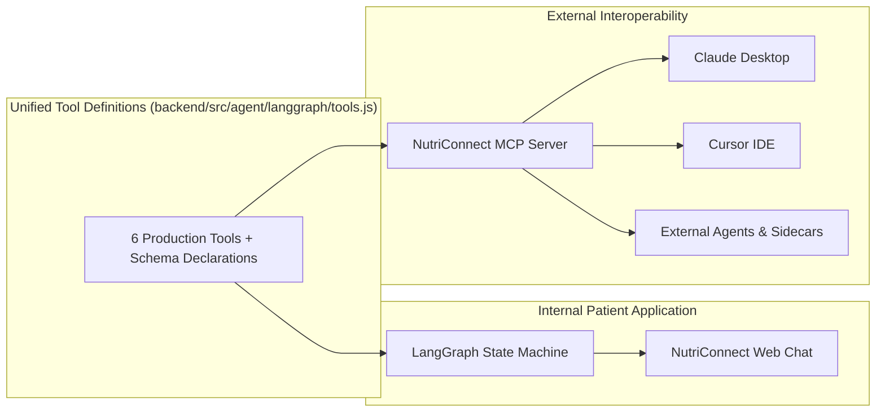

# NutriAgent: Complete Clinical AI Agent Architecture

This document provides a comprehensive technical overview of the NutriAgent platform, including the complete codebase folder structure, the end-to-end processing pipeline, and the synergistic integration of LangGraph and the Model Context Protocol (MCP).

---

## 1. Directory Structure

The agentic pipeline is organized across backend and frontend layers starting from the workspace root:

### Path Breadcrumbs
- `root > backend > src > agent > langgraph/`
- `root > backend > src > agent > mcp/`
- `root > backend > src > agent > services/`
- `root > backend > src > agent > tools/`
- `root > backend > src > agent > utils/`
- `root > frontend > src > agent/`
- `root > frontend > src > agent > features/`

### Complete Hierarchical File Tree

```text
root
> backend
  > src
    > agent
      > langgraph
        > graph.js
        > index.js
        > nodes.js
        > state.js
        > tools.js
      > mcp
        > mcp-server.js
        > mcp-transport-sse.js
      > services
        > attentionAnalyzer.js
        > ragRetriever.js
        > specialistService.js
        > userResolver.js
      > tools
        > booking.tool.js
        > mealPlan.tool.js
        > nutrition.tool.js
        > schedule.tool.js
        > searchDietitians.tool.js
      > utils
        > dateUtils.js
      > config.js
      > index.js
    > models
      > agentModel.js
    > server.js
  > tests
    > agent.test.js
  > test-langgraph.js
> frontend
  > src
    > agent
      > features
        > BookingConfirmationCard.jsx
        > BotFormattedText.jsx
        > constants.js
        > DietitianCard.jsx
        > index.js
        > MealPlanCard.jsx
        > NutritionCard.jsx
        > PatientProfileCard.jsx
        > SlotBookingCard.jsx
        > UploadedDocumentCard.jsx
        > UserScheduleCard.jsx
      > AgentSidebar.jsx
      > NutriAgentPage.jsx
```

---

## 2. End-to-End System Architecture

```mermaid
flowchart TD
    User([Patient / External Host]) -->|Prompt + Context| Interface{Interface Layer}
    
    subgraph Frontend_App["Frontend (React)"]
        Interface -->|Web Chat| NutriAgentPage[NutriAgentPage.jsx]
        NutriAgentPage -->|HTTP POST /api/agent/chat| ExpressRouter[Agent Router (index.js)]
    end

    subgraph External_Clients["External Hosts"]
        Interface -->|Claude Desktop / Cursor| StdioTransport[Stdio Transport]
        Interface -->|Remote Web Clients| SSETransport[SSE Transport (/mcp/sse)]
        StdioTransport --> MCPServer[MCP Server (mcp-server.js)]
        SSETransport --> MCPServer
    end

    ExpressRouter --> LangGraphEntry[runLangGraphAgent()]
    MCPServer -->|Direct Tool Call| ToolRegistry[Tool Execution Registry (tools.js)]

    subgraph LangGraph_Workflow["LangGraph State Machine Engine"]
        LangGraphEntry --> Node1[1. Grounding Node]
        Node1 -->|Fetch Lab Records| RAG[RAG Retriever]
        RAG --> Node2[2. Reasoning Node]
        
        Node2 -->|Analyze Query| Attention[Attention Analyzer]
        Attention -->|Intent & Scoped Tools| ScopedTools[Scoped Tool Declarations]
        ScopedTools --> GeminiReasoning[Gemini 2.5 Flash Lite]
        
        GeminiReasoning --> Decision{Tool Calls Emitted?}
        Decision -->|Yes (Single or Parallel)| Node3[3. Tool Node]
        Decision -->|No| Node4[4. Synthesis Node]
        
        Node3 -->|Execute via Promise.all| ToolRegistry
        ToolRegistry --> Node4
        
        Node4 -->|Grounding + Findings| GeminiSynthesis[Gemini Synthesis Engine]
        GeminiSynthesis --> FinalReply[State: finalReply + cards]
    end

    subgraph Tool_Ecosystem["Production Clinical Tools"]
        ToolRegistry --> ToolSearch[search_dietitians]
        ToolRegistry --> ToolAvail[check_dietitian_availability]
        ToolRegistry --> ToolSched[get_user_schedule]
        ToolRegistry --> ToolBook[book_dietitian_appointment]
        ToolRegistry --> ToolNutri[lookup_nutrition]
        ToolRegistry --> ToolMeal[generate_meal_plan]
    end

    FinalReply --> ResponseFormatter[Response Formatter & DB Persistence]
    ResponseFormatter -->|JSON: reply + cards| NutriAgentPage
    NutriAgentPage --> RenderCards[Render Interactive Feature Cards]
```

---

## 3. How LangGraph and MCP Work Together

LangGraph and the Model Context Protocol (MCP) serve two complementary roles in NutriConnect:



### 1. LangGraph as the Autonomous Clinical Orchestrator
LangGraph manages the internal, multi-turn clinical cognitive cycle:
- It maintains state across turns using checkpointable state channels.
- It grounds every conversation turn in the patient's real medical history, lab test reports (HbA1c, lipid profiles), and active dietitian care plans.
- It controls execution flow through strict conditional branching, preventing random tool hallucinations and enforcing human-friendly clinical communication.

### 2. MCP as the Standardized External Interface
MCP allows the exact same clinical tools and resources to be consumed by any external LLM or agent host:
- Instead of re-implementing tools, the MCP server imports the unified tool declarations (`GEMINI_TOOL_DECLARATIONS`) and execution engine (`executeLangGraphTool`) directly from LangGraph.
- External applications (like Claude Desktop or Cursor) connect via stdio or SSE and immediately gain access to NutriConnect's specialist registry, nutrition computation, and scheduling tools without needing direct database access.

---

## 4. Node-by-Node Pipeline Lifecycle

### Node 1: Grounding Node (`groundingNode`)
- **Inputs**: User query, conversation history, user authentication ID.
- **Action**: Queries MongoDB via `ragRetriever.js` to retrieve the patient's verified health records, recent lab panels (fasting blood sugar, HbA1c, cholesterol, triglycerides), and active supervising dietitian assessments.
- **Output**: Populates `state.groundingContext` and attaches patient profile cards if requested.

### Node 2: Reasoning Node (`reasoningNode`)
- **Inputs**: Patient query, temporal context (IST date/time, clinic operating hours), grounding context.
- **Action**: Runs `analyzeQueryAttention(userPrompt)` to classify intent:
  - Single-intent fast-paths (Specialist search, schedule availability, appointment booking, patient schedule).
  - Compound multi-tool queries (queries requiring 2 or 3 tools simultaneously).
  - Scopes tool declarations strictly to allowable actions.
- **Output**: Emits tool calls array (`state.toolCalls`) via Gemini function calling.

### Node 3: Tool Node (`toolNode`)
- **Inputs**: `state.toolCalls`.
- **Action**: Executes all emitted tool calls concurrently using `Promise.all`.
- **Output**: Aggregates structured data results into `state.toolResults` and appends corresponding interactive UI cards (`dietitian_cards`, `slot_booking_card`, `nutrition_card`, `meal_plan_card`, `user_schedule_card`) to `state.cards`.

### Node 4: Synthesis Node (`synthesisNode`)
- **Inputs**: Patient query, temporal context, tool execution findings, clinical context.
- **Action**: Synthesizes a human-centered, empathetic response:
  - Enforces plain, everyday language (translates biological jargon into simple terms).
  - Enforces the strict anti-hallucination guardrail: only verified doctors from findings may be referenced.
  - Enforces zero emojis across all output text.
- **Output**: Sets `state.finalReply`.

---

## 5. Security and Safety Guardrails

1. **Zero Doctor Hallucinations**: The system prompt explicitly forbids fabricating or inventing doctor names. If no specialists match the criteria, the agent explicitly states that no specialists were found.
2. **Clinical Prescription Boundary**: Prohibits prescribing pharmaceutical medications (metformin, insulin adjustments, statins), directing users to consult a licensed medical doctor.
3. **Temporal Precision**: Injects real-time IST clock and calendar context so the agent never presents past hours as available slots or confuses clinic hours with patient appointments.
4. **IDOR & PII Protection**: Data access is scoped to the authenticated user ID extracted from the JWT token.
