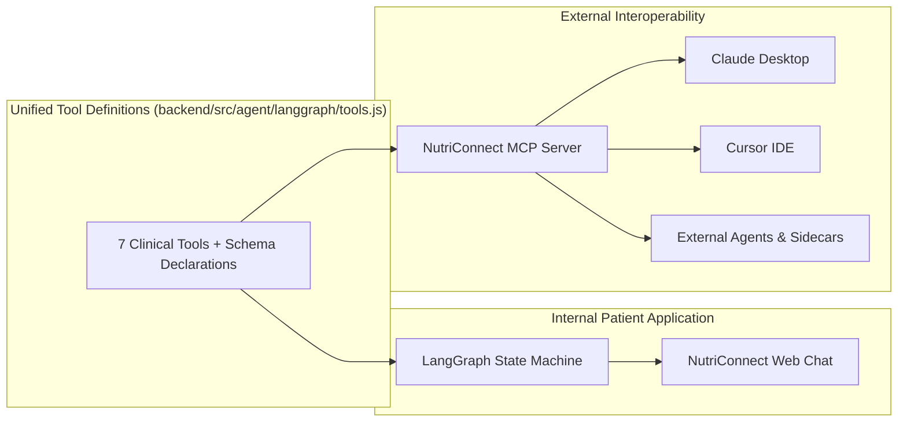

# NutriAgent: Complete Clinical AI Agent Architecture

This document provides a comprehensive technical overview of the NutriAgent platform, including the complete codebase folder structure, the end-to-end processing pipeline, and the synergistic integration of LangGraph and the Model Context Protocol (MCP).

---

## 1. Core Architecture Principles (Zero RAG)

NutriAgent operates on deterministic, production-grade agentic principles:
- **No Vector RAG**: There are zero vector databases, zero text embeddings (no `text-embedding-004`), and zero chunking/cosine similarity searches.
- **Direct Clinical Grounding**: Patient medical profiles, diagnosis records, lab panels, and supervising dietitian recommendations are ingested directly from MongoDB collections (`HealthReport`, `User`, `Booking`, `Dietitian`) into the LangGraph state.
- **Stateful LangGraph Workflow**: Controlled execution flow through a directed acyclic state graph (`StateGraph`) with memory checkpointing (`MemorySaver`).
- **Structured Tool Calling**: Google Gemini (`gemini-3.1-flash-lite`, `gemini-3.5-flash`) reasons over user queries and emits structured tool function calls without regex or custom keyword branching.
- **Verified Registry Only**: Zero fabrication of doctors or medical data. All specialist, scheduling, and nutrition facts originate from authoritative databases and APIs.
- **Zero Emojis**: Strict enforcement across all generated responses, comments, and system prompts.

---

## 2. Directory Structure

The agentic pipeline is organized across backend and frontend layers:

### Complete Hierarchical File Tree

```text
root
> backend
  > src
    > agent
      > apis
        > apiClient.js
        > booking.api.js
        > healthMetrics.api.js
        > mealPlan.api.js
        > nutrition.api.js
        > schedule.api.js
        > specialist.api.js
      > langgraph
        > graph.js
        > index.js
        > nodes.js
        > state.js
        > tools.js
      > mcp
        > mcp-server.js
        > mcp-transport-sse.js
      > services
        > agentContextLoader.js
        > userResolver.js
      > tools
        > booking.tool.js
        > healthReports.tool.js
        > mealPlan.tool.js
        > nutrition.tool.js
        > schedule.tool.js
        > searchDietitians.tool.js
      > utils
        > dateUtils.js
      > config.js
      > index.js
      > guardrails.js
    > models
      > agentModel.js
      > healthReportModel.js
      > userModel.js
      > bookingModel.js
    > server.js
  > tests
    > agent.test.js
> frontend
  > src
    > agent
      > features
        > BookingConfirmationCard.jsx
        > BotFormattedText.jsx
        > constants.js
        > DietitianCard.jsx
        > index.js
        > MealPlanCard.jsx
        > NutritionCard.jsx
        > PatientProfileCard.jsx
        > SlotBookingCard.jsx
        > UploadedDocumentCard.jsx
        > UserScheduleCard.jsx
      > AgentSidebar.jsx
      > NutriAgentPage.jsx
```

---

## 3. End-to-End System Architecture

```mermaid
flowchart TD
    User([Patient / External Host]) -->|Prompt + Context| Interface{Interface Layer}
    
    subgraph Frontend_App["Frontend (React)"]
        Interface -->|Web Chat| NutriAgentPage[NutriAgentPage.jsx]
        NutriAgentPage -->|HTTP POST /api/agent/chat| ExpressRouter[Agent Router (index.js)]
    end

    subgraph External_Clients["External Hosts"]
        Interface -->|Claude Desktop / Cursor| StdioTransport[Stdio Transport]
        Interface -->|Remote Web Clients| SSETransport[SSE Transport (/mcp/sse)]
        StdioTransport --> MCPServer[MCP Server (mcp-server.js)]
        SSETransport --> MCPServer
    end

    ExpressRouter --> LangGraphEntry[runLangGraphAgent()]
    MCPServer -->|Direct Tool Call| ToolRegistry[Tool Execution Registry (tools.js)]

    subgraph LangGraph_Workflow["LangGraph State Machine Engine"]
        LangGraphEntry --> Node1["1. Context Ingestion Node (contextIngestionNode)"]
        Node1 -->|Direct MongoDB Profile Loading| Node2["2. Reasoning Node (reasoningNode)"]
        
        Node2 -->|System Prompt + Gemini Tool Declarations| GeminiReasoning[Google Gemini Engine]
        
        GeminiReasoning --> Decision{Tool Calls Emitted?}
        Decision -->|Yes (Single or Concurrent)| Node3["3. Tool Execution Node (toolNode)"]
        Decision -->|No| Node4["4. Synthesis Node (synthesisNode)"]
        
        Node3 -->|Execute via Promise.all| ToolRegistry
        ToolRegistry --> Node4
        
        Node4 -->|Verified Findings + Clinical Context| GeminiSynthesis[Gemini Plain Language Synthesis]
        GeminiSynthesis --> FinalReply[State: finalReply + cards]
    end

    subgraph Tool_Ecosystem["Production Clinical Tools & APIs"]
        ToolRegistry --> ToolSearch[search_dietitians]
        ToolRegistry --> ToolAvail[check_dietitian_availability]
        ToolRegistry --> ToolSched[get_user_schedule]
        ToolRegistry --> ToolBook[book_dietitian_appointment]
        ToolRegistry --> ToolNutri[lookup_nutrition]
        ToolRegistry --> ToolMeal[generate_meal_plan]
        ToolRegistry --> ToolReports[get_user_health_reports]
    end

    FinalReply --> ResponseFormatter[Response Formatter & DB Persistence]
    ResponseFormatter -->|JSON: reply + cards| NutriAgentPage
    NutriAgentPage --> RenderCards[Render Interactive Feature Cards]
```

---

## 4. How LangGraph and MCP Work Together

LangGraph and the Model Context Protocol (MCP) share a single unified execution core:



### 1. LangGraph as the Autonomous Clinical Orchestrator
LangGraph manages the internal, multi-turn clinical cognitive cycle:
- It maintains state across conversation turns using checkpointable state channels (`MemorySaver`).
- It grounds every turn in real patient records (`HealthReport`, recent lab panels, supervising dietitian recommendations) directly loaded from MongoDB.
- It controls execution flow through strict conditional branching, preventing infinite loops and ensuring high reliability.

### 2. MCP as the Standardized External Interface
MCP allows external AI agents to use the exact same clinical tools:
- The MCP server imports the unified tool declarations (`GEMINI_TOOL_DECLARATIONS`) and execution engine (`executeLangGraphTool`) straight from `tools.js`.
- External hosts connect via Stdio or Server-Sent Events (SSE at `/api/agent/mcp/sse`) and access specialist discovery, scheduling, meal planning, and nutrition tools.

---

## 5. Node-by-Node Pipeline Lifecycle

### Node 1: Context Ingestion Node (`contextIngestionNode`)
- **Inputs**: `state.userId`, `state.authUserId`.
- **Action**: Queries MongoDB via `agentContextLoader.js` to retrieve the patient's verified health records, lab panels (fasting glucose, HbA1c, lipids), and active supervising dietitian assessments.
- **Output**: Populates `state.patientProfile`, `state.clinicalContextText`, and attaches `patient_profile_card` if available.

### Node 2: Reasoning Node (`reasoningNode`)
- **Inputs**: `state.userQuery`, temporal context (IST date/time, clinic operating hours: 09:00 AM - 08:00 PM), `state.clinicalContextText`.
- **Action**: Sends system instructions, temporal context, patient context, and `GEMINI_TOOL_DECLARATIONS` to Google Gemini. Gemini evaluates intent and emits tool calls.
- **Output**: Emits tool calls array (`state.toolCalls`).

### Node 3: Tool Execution Node (`toolNode`)
- **Inputs**: `state.toolCalls`.
- **Action**: Executes all emitted tool calls concurrently using `Promise.all` via `executeLangGraphTool`.
- **Output**: Aggregates structured data results into `state.toolResults` and appends corresponding interactive UI cards (`dietitian_cards`, `slot_booking_card`, `nutrition_card`, `meal_plan_card`, `user_schedule_card`) to `state.cards`.

### Node 4: Synthesis Node (`synthesisNode`)
- **Inputs**: Patient query, temporal context, tool execution findings, clinical context.
- **Action**: Synthesizes a human-centered, empathetic response:
  - Translates clinical numbers into simple, everyday language.
  - Enforces strict anti-hallucination guardrail: only verified doctors from findings may be referenced.
  - Enforces zero emojis across all output text.
- **Output**: Sets `state.finalReply`.

---

## 6. Security and Safety Guardrails

1. **Zero Doctor Hallucinations**: Fabricating doctor names or credentials is strictly forbidden. If no specialists match the search criteria, the agent explicitly states this.
2. **Clinical Non-Prescription Boundary**: Pharmaceutical drug prescriptions (metformin, insulin adjustments, statins) are strictly barred. Patients are guided to consultation with licensed physicians.
3. **Temporal Precision**: Injects real-time IST clock and calendar context so past slots are never offered and operating hours (09:00 AM to 08:00 PM daily) are respected.
4. **IDOR & Identity Resolution**: Session access and patient data are strictly validated against authenticated JWT tokens.
