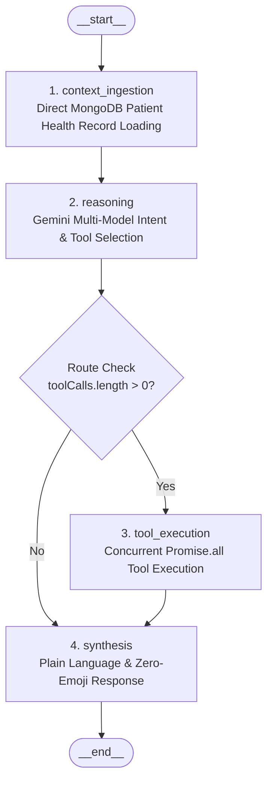

# LangGraph: Clinical Agent Architecture & Implementation in NutriConnect

This document explains what LangGraph is, why it was chosen for NutriConnect, how our cyclical state graph is designed, and how each node and edge operates in production.

---

## 1. What Is LangGraph?

**LangGraph** is a framework developed by LangChain for building stateful, multi-actor applications with Large Language Models using graph-based control flow.

### Why Not Traditional Linear Chains?
Traditional LLM chains (like standard prompt chains or basic LCEL pipelines) are strictly linear (A -> B -> C). They fail in clinical workflows because:
- Medical inquiries are non-linear (a patient may ask about food, inquire about a doctor, and request a booking in one message).
- Standard ReAct loops without graph boundaries are prone to endless loops or random tool hallucinations.
- Clinical safety requires guaranteed checkpoints where patient health context is loaded before reasoning begins.

### Why LangGraph for NutriConnect?
1. **Deterministic State Machine**: Every step in the conversation is an explicit node with defined input and output schemas.
2. **Cyclical & Branching Logic**: Enables parallel tool execution, conditional branching, and fallback models.
3. **State Persistence**: Every turn's state (messages, clinical context, UI cards) is tracked through state channels and persisted with `MemorySaver`.
4. **Safety Boundaries**: Anti-hallucination guardrails and non-prescription boundaries are enforced as discrete graph constraints.
5. **Zero RAG / Direct Grounding**: Instead of vector embeddings and retrieval pipelines, clinical context is loaded directly from MongoDB records into state before reasoning.

---

## 2. Directory Location & File Structure

The LangGraph architecture is structured inside `backend/src/agent/langgraph/`:

### File Layout

```text
backend
> src
  > agent
    > langgraph
      > graph.js    // StateGraph definition, node binding, compilation
      > index.js    // Entry point: runLangGraphAgent runner
      > nodes.js    // contextIngestionNode, reasoningNode, toolNode, synthesisNode
      > state.js    // AgentState annotation and channel reducers
      > tools.js    // Declarations, schemas, executeLangGraphTool registry
    > apis          // Dedicated tool API implementations
    > services      // agentContextLoader.js, userResolver.js
    > tools         // Tool declarations and execution handlers
    > utils         // dateUtils.js
    > config.js     // Gemini models & SDK initialization
    > index.js      // Express router mounting /api/agent/*
    > guardrails.js // Central clinical rules, safety guardrails & prompt builder
```

---

## 3. Graph Topology & Workflow Design

The NutriConnect LangGraph workflow is modeled as a state graph with conditional routing:



---

## 4. State Schema & Channels (`state.js`)

The state represents the single source of truth passed across all nodes in the graph. It is defined using `@langchain/langgraph` channel annotations:

```javascript
const AgentState = Annotation.Root({
  userQuery: Annotation({
    reducer: (x, y) => y ?? x,
    default: () => "",
  }),
  userId: Annotation({
    reducer: (x, y) => y ?? x,
    default: () => null,
  }),
  authUserId: Annotation({
    reducer: (x, y) => y ?? x,
    default: () => null,
  }),
  messages: Annotation({
    reducer: (x, y) => (y && y.length > 0 ? y : x),
    default: () => [],
  }),
  file: Annotation({
    reducer: (x, y) => y ?? x,
    default: () => null,
  }),
  patientProfile: Annotation({
    reducer: (x, y) => y ?? x,
    default: () => null,
  }),
  clinicalContextText: Annotation({
    reducer: (x, y) => y ?? x,
    default: () => "",
  }),
  identifiedOperation: Annotation({
    reducer: (x, y) => y ?? x,
    default: () => null,
  }),
  requiredParameters: Annotation({
    reducer: (x, y) => ({ ...(x || {}), ...(y || {}) }),
    default: () => ({}),
  }),
  toolCalls: Annotation({
    reducer: (x, y) => y ?? x,
    default: () => [],
  }),
  toolResults: Annotation({
    reducer: (x, y) => y ?? x,
    default: () => [],
  }),
  toolsExecuted: Annotation({
    reducer: (x, y) => Array.from(new Set([...(x || []), ...(y || [])])),
    default: () => [],
  }),
  cards: Annotation({
    reducer: (x, y) => y ?? x,
    default: () => [],
  }),
  openPaymentDetails: Annotation({
    reducer: (x, y) => (y !== undefined ? y : null),
    default: () => null,
  }),
  rawReply: Annotation({
    reducer: (x, y) => y ?? x,
    default: () => "",
  }),
  finalReply: Annotation({
    reducer: (x, y) => y ?? x,
    default: () => "",
  }),
  executionStatus: Annotation({
    reducer: (x, y) => y ?? x,
    default: () => "idle",
  }),
});
```

---

## 5. Node Implementations (`nodes.js`)

### Node 1: `context_ingestion` (`contextIngestionNode`)
Retrieves real patient medical background without vector databases:
- Calls `loadAgentPatientContext(userId)` from `services/agentContextLoader.js`.
- Queries MongoDB `User` and `HealthReport` collections.
- Extracted parameters include recent diagnosis, blood biomarkers (HbA1c, fasting glucose, lipid counts), target macros, target calories, known allergies, and supervising dietitian notes.
- Generates `patient_profile_card` for immediate UI rendering.

### Node 2: `reasoning` (`reasoningNode`)
Evaluates the patient inquiry against clinical tools:
- Injects temporal context (IST date/time and clinic operating hours 09:00 AM to 08:00 PM).
- Injects patient clinical context.
- Binds `GEMINI_TOOL_DECLARATIONS` to Google Gemini.
- Uses retry/fallback across candidate models (`gemini-3.1-flash-lite`, `gemini-3.5-flash`).
- Emits structured tool calls with validated arguments.

### Node 3: `tool_execution` (`toolNode`)
Executes all requested tools concurrently:
- Uses `Promise.all` to run all tool calls simultaneously:
  ```javascript
  const toolResults = await Promise.all(
    toolCalls.map(async (call) => {
      const { name, args } = call;
      const res = await executeLangGraphTool(name, args, {
        userId: state.userId,
        authUserId: state.authUserId,
        userQuery: state.userQuery,
      });
      return { tool: name, args, ...res };
    })
  );
  ```
- Collects UI cards from tools (`dietitian_cards`, `slot_booking_card`, `nutrition_card`, `meal_plan_card`, `user_schedule_card`) and deduplicates them into `state.cards`.

### Node 4: `synthesis` (`synthesisNode`)
Synthesizes the final conversational response presented to the patient:
- Combines tool execution results, temporal context, and clinical grounding.
- Enforces three strict clinical guidelines:
  1. **Everyday Language**: Translates medical numbers into simple, clear words.
  2. **Zero Doctor Hallucinations**: Strictly prohibits mentioning doctor names that were not provided in verified findings.
  3. **Strict Zero Emojis**: Strips all emoji characters via regex filter.

---

## 6. Conditional Routing (`graph.js`)

```javascript
function routeAfterReasoning(state) {
  if (state.toolCalls && state.toolCalls.length > 0) {
    return "tool_execution";
  }
  return "synthesis";
}

function createNutriAgentGraph() {
  const workflow = new StateGraph(AgentState);

  workflow.addNode("context_ingestion", contextIngestionNode);
  workflow.addNode("reasoning", reasoningNode);
  workflow.addNode("tool_execution", toolNode);
  workflow.addNode("synthesis", synthesisNode);

  workflow.addEdge(START, "context_ingestion");
  workflow.addEdge("context_ingestion", "reasoning");

  workflow.addConditionalEdges("reasoning", routeAfterReasoning, {
    tool_execution: "tool_execution",
    synthesis: "synthesis",
  });

  workflow.addEdge("tool_execution", "synthesis");
  workflow.addEdge("synthesis", END);

  const checkpointer = new MemorySaver();
  return workflow.compile({ checkpointer });
}
```
