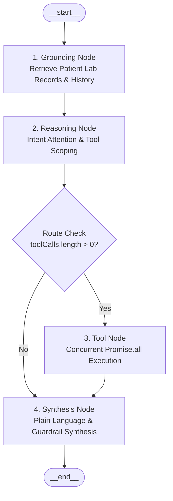

# LangGraph: Clinical Agent Architecture & Implementation in NutriConnect

This document explains what LangGraph is, why it was chosen for NutriConnect, how our cyclical state graph was designed, and how each node and edge operates in production.

---

## 1. What Is LangGraph?

**LangGraph** is a framework developed by LangChain for building stateful, multi-actor applications with Large Language Models using graph-based control flow.

### Why Not Traditional Linear Chains?
Traditional LLM chains (like standard prompt chains or basic LCEL pipelines) are strictly linear (A -> B -> C). They fail in clinical workflows because:
- Medical inquiries are non-linear (a patient may start with a food question, ask about a doctor, and then request a meal plan).
- ReAct loops without graph boundaries are prone to endless loops or random tool hallucinations.
- Clinical safety requires guaranteed checkpoints where patient data is grounded before reasoning begins.

### Why LangGraph for Healthcare & Nutrition?
1. **Deterministic State Machine**: Every step in the conversation is an explicit node with defined input and output schemas.
2. **Cyclical & Branching Logic**: Enables parallel tool execution, conditional branching, and iterative refinement.
3. **State Persistence**: Every turn's state (messages, clinical context, UI cards) is tracked through state channels.
4. **Safety Boundaries**: Anti-hallucination guardrails and non-prescription boundaries can be enforced as discrete graph constraints.

---

## 2. Directory Location & File Structure

The LangGraph architecture is structured from the workspace root as follows:

### Path Breadcrumb
`root > backend > src > agent > langgraph/`

### File Layout

```text
root
> backend
  > src
    > agent
      > langgraph
        > graph.js
        > index.js
        > nodes.js
        > state.js
        > tools.js
      > services
      > tools
      > utils
      > config.js
      > index.js
```

---

## 3. Graph Topology & Workflow Design

The NutriConnect LangGraph workflow is modeled as a directed acyclic state graph (DAG) with conditional routing:



---

## 3. State Schema & Channels (`state.js`)

The state represents the single source of truth passed across all nodes in the graph. It is defined using `@langchain/langgraph` channel annotations:

```javascript
const AgentStateAnnotation = Annotation.Root({
  userQuery: Annotation({
    reducer: (curr, next) => next !== undefined ? next : curr,
    default: () => "",
  }),
  userId: Annotation({
    reducer: (curr, next) => next !== undefined ? next : curr,
    default: () => null,
  }),
  authUserId: Annotation({
    reducer: (curr, next) => next !== undefined ? next : curr,
    default: () => null,
  }),
  messages: Annotation({
    reducer: (curr, next) => next !== undefined ? next : curr,
    default: () => [],
  }),
  cards: Annotation({
    reducer: (curr, next) => next !== undefined ? next : curr,
    default: () => [],
  }),
  toolsExecuted: Annotation({
    reducer: (curr, next) => Array.from(new Set([...(curr || []), ...(next || [])])),
    default: () => [],
  }),
  groundingContext: Annotation({
    reducer: (curr, next) => next !== undefined ? next : curr,
    default: () => "",
  }),
  toolCalls: Annotation({
    reducer: (curr, next) => next !== undefined ? next : curr,
    default: () => [],
  }),
  toolResults: Annotation({
    reducer: (curr, next) => next !== undefined ? next : curr,
    default: () => [],
  }),
  rawReply: Annotation({
    reducer: (curr, next) => next !== undefined ? next : curr,
    default: () => "",
  }),
  finalReply: Annotation({
    reducer: (curr, next) => next !== undefined ? next : curr,
    default: () => "",
  }),
  file: Annotation({
    reducer: (curr, next) => next !== undefined ? next : curr,
    default: () => null,
  }),
});
```

---

## 4. Deep Dive: Node Implementations (`nodes.js`)

### Node 1: `groundingNode`
Retrieves background medical context without triggering external actions.
- Queries MongoDB via `retrieveRAGContext()` to fetch verified patient lab panels (HbA1c, fasting glucose, LDL, HDL, Triglycerides).
- Injects active supervising dietitian clinical notes (e.g., allergies, daily protein/calorie targets).
- Ensures subsequent nodes have verified clinical facts, preventing the model from hallucinating medical history.

### Node 2: `reasoningNode`
Performs query attention analysis and decides what actions (if any) to take.
- **Query Attention Analysis**: Passes the query through `analyzeQueryAttention()`.
- **Fast-Path Shortcuts**: If high-confidence parameters were extracted for a single intent (e.g. appointment booking or specialist search), it immediately constructs the exact tool call without unnecessary LLM overhead.
- **Compound Query Handling**: If the query contains multiple requests (e.g. searching for a doctor, checking slots, and looking up food macros), it sets `primaryIntent = 'COMPOUND'`, scopes all matching tool declarations, and sends them to Gemini.
- **Gemini Function Calling**: Uses `gemini-flash-lite-latest` to emit tool calls in parallel.

### Node 3: `toolNode`
Executes all requested tools concurrently and compiles interactive UI cards.
- Uses `Promise.all` to run all tool calls simultaneously:
  ```javascript
  const toolResults = await Promise.all(
    toolCalls.map(async (call) => {
      const { name, args } = call;
      const res = await executeLangGraphTool(name, args, {
        userId: state.userId,
        authUserId: state.authUserId,
        userQuery: state.userQuery,
      });
      return { tool: name, args, ...res };
    })
  );
  ```
- Collects UI cards from each tool (`dietitian_cards`, `slot_booking_card`, `nutrition_card`, `meal_plan_card`, `user_schedule_card`) and deduplicates them into `state.cards`.

### Node 4: `synthesisNode`
Synthesizes the final conversational response presented to the patient.
- Combines tool execution results, temporal context (current time in IST, operating hours), and clinical grounding.
- Enforces three strict clinical guidelines:
  1. **Everyday Language**: Translates biological jargon into simple, empowering words.
  2. **Zero Doctor Hallucinations**: Strictly prohibits mentioning doctor names that were not provided in verified findings.
  3. **Strict Zero Emojis**: Strips all emoji characters via regex filter.

---

## 5. Conditional Routing (`graph.js`)

The graph uses a conditional edge from `reasoningNode` to decide whether tool execution is necessary:

```javascript
function shouldContinue(state) {
  const toolCalls = state.toolCalls || [];
  if (toolCalls.length > 0) {
    return "tools";
  }
  return "synthesis";
}

const workflow = new StateGraph(AgentStateAnnotation)
  .addNode("grounding", groundingNode)
  .addNode("reasoning", reasoningNode)
  .addNode("tools", toolNode)
  .addNode("synthesis", synthesisNode)
  .addEdge("__start__", "grounding")
  .addEdge("grounding", "reasoning")
  .addConditionalEdges("reasoning", shouldContinue, {
    tools: "tools",
    synthesis: "synthesis",
  })
  .addEdge("tools", "synthesis")
  .addEdge("synthesis", "__end__");

const checkpointer = new MemorySaver();
const nutriAgentGraph = workflow.compile({ checkpointer });
```

---

## 6. How Compound Multi-Tool Queries Work

When a patient asks a compound question:
> *"Find me a verified dietitian for heart health, check Dr. Arjun Reddy available slots tomorrow, and tell me the calories and protein in 100g oats"*

1. **`attentionAnalyzer`** detects that 3 intents matched (`SPECIALIST_SEARCH`, `SCHEDULE_AVAILABILITY`, `NUTRITION_LOOKUP`).
2. It sets `primaryIntent = 'COMPOUND'` and scopes 3 tools: `['search_dietitians', 'check_dietitian_availability', 'lookup_nutrition']`.
3. In **`reasoningNode`**, Gemini receives all 3 tool declarations and emits 3 parallel function calls.
4. In **`toolNode`**, all 3 tools run concurrently via `Promise.all`.
5. Three interactive cards are attached: `dietitian_cards`, `slot_booking_card`, and `nutrition_card`.
6. In **`synthesisNode`**, a unified everyday explanation is generated addressing the doctors, the available slots, and the nutrition facts in a single turn.
